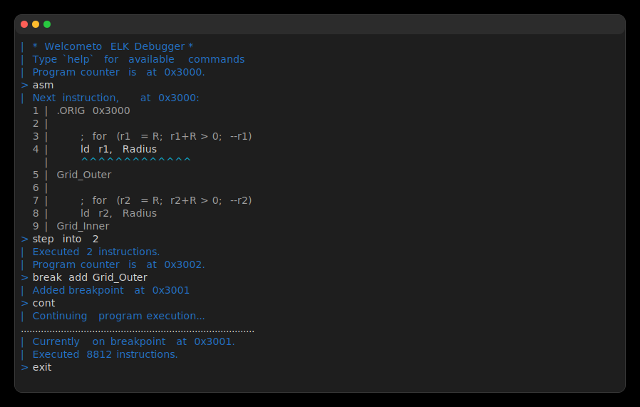
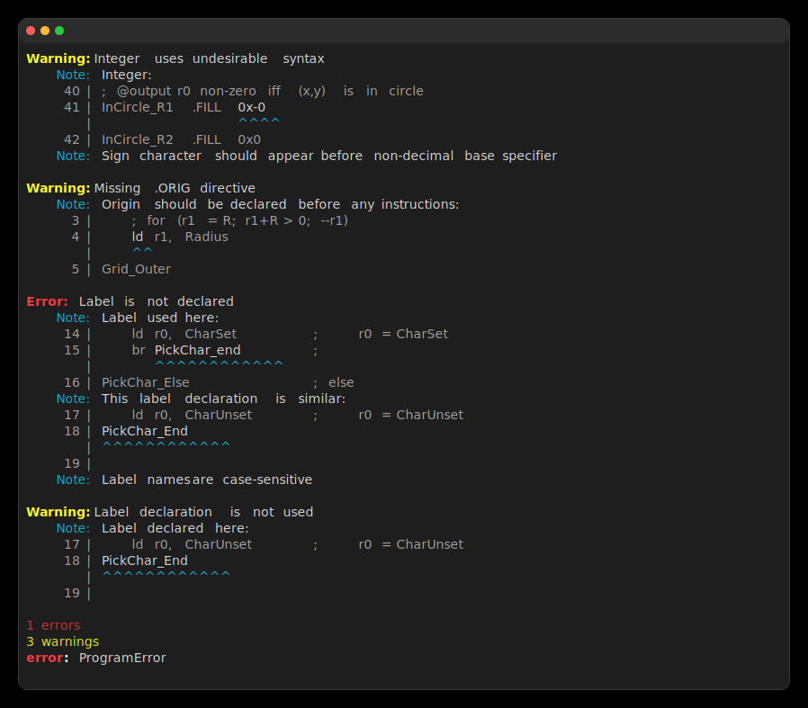

# Elk

Complete [LC-3](https://en.wikipedia.org/wiki/Little_Computer_3) toolchain.
Available as both a [Zig](https://ziglang.org) library and a command-line
program.

[Official Codeberg repository](https://codeberg.org/dxrcy/elk)
| [GitHub mirror](https://github.com/dxrcy/elk)



# Usage

```sh
# Show all options
elk --help
# Assemble and emulate
elk hello.asm
# Assemble and debug
elk hello.asm --debug
# Assemble to object file
elk hello.asm --assemble [--output hello.obj]
# Emulate object file
elk hello.obj --emulate
```

## Installation

1. Download the latest binary release from
[GitHub releases](https://github.com/dxrcy/elk/releases/latest).
2. Install the downloaded file to your PATH:

```sh
sudo install <filename> /usr/bin/elk
```

### From source

Alternatively, you can build `elk` from source, only requiring
[Zig `0.16.0`](https://ziglang.org/download/#release-0.16.0):

```sh
git clone https://codeberg.org/dxrcy/elk
cd elk/cli

zig build install -Doptimize=ReleaseSafe
sudo install zig-out/bin/elk /usr/bin/
```



# Features

- [x] Assembler (includes linting)
- [x] Emulator
- [x] Debugger (see below)
- [ ] Formatter ([see issue](https://codeberg.org/dxrcy/elk/issues/14))

## Debugger Features

- [x] Step through execution
- [x] Inspect/modify registers and memory
- [x] View current line in assembly source
- [x] Set breakpoints
- [x] Evaluate arbitrary instructions
- [x] Recover from `HALT` and runtime exceptions
- [x] Persistent history across program runs
- [ ] Import label declarations from symbol table
([see issue](https://codeberg.org/dxrcy/elk/issues/12))

## Optional Extension Features

- [x] Builtin debug traps (compatible with
[Lace](https://github.com/rozukke/lace))
- [x] Stack instructions (compatible with
[Lace](https://github.com/rozukke/lace))
- [x] Extra-permissive assembly syntax
- [x] Parsing of character literals as integers
- [x] Full support for arbitrary user-defined traps
- [x] Support for arbitrary runtime hooks
- [x] Patch label values after assembling
- [x] Output symbol table and assembly listing
- [ ] Multiple file support (compatible with
[Laser](https://github.com/PaperFanz/laser))
- [ ] Preprocessor macros (compatible with
[Leap](https://github.com/twhlynch/leap))

## Quality-of-Life Features

- [x] Descriptive warnings and error messages
- [x] Assembly code style hints
- [x] Multiple labels can annotate a single address

## Other Toolchain Components

- [x] [Tree-sitter parser](https://codeberg.org/dxrcy/tree-sitter-lc3)
(syntax highlighting)
- [x] [Inline diagnostics for VSCode](https://github.com/twhlynch/lc3-elk-diagnostics)
- [x] [Inline diagnostics for Neovim](https://github.com/twhlynch/elk.nvim)
- [ ] Language server ([see issue](https://codeberg.org/dxrcy/elk/issues/32))

## Supported Applications

- [x] [ELCI](https://github.com/rozukke/lace/tree/minecraft) inter-op (see
[`minecraft` branch](https://codeberg.org/dxrcy/elk/src/branch/minecraft))
- [ ] Automatic testing framework

# Contributors

<!-- Codeberg has no equivalent -->
<a href="https://github.com/dxrcy/elk/graphs/contributors">
    
</a>

